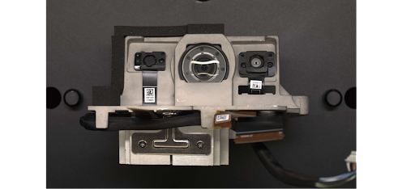
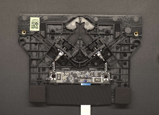

# Hardware
This chapter intends to offer a concise overview of the Amazon Glow's internal workings, detailing its hardware components, reference designators, and providing a practical explanation of how each component functions.

## Motherboard
The motherboard houses all of devices processing units, networking, memory, etc., and like the name says, it is the brains of the operation. The following table contains a list of the most important components installed on the motherboard.

| Component             | Manufacturer      | Serial/Product number     | Links                                                                                              | Details                      |     |
| --------------------- | ----------------- | ------------------------- | -------------------------------------------------------------------------------------------------- | ---------------------------- | --- |
| CPU SoC               | Qualcomm          | SDA660 JKL307PD           | https://www.qualcomm.com/products/technology/processors/application-processors/sda660              |                              |     |
| DRAM                  | Micron Technology | 9IQA77 D9XGR              | https://eu.mouser.com/ProductDetail/Micron/MT53D768M32D2NP-046-WTA?qs=XeJtXLiO41QODVvJwTiOVg%3D%3D |                              |     |
| Onboard memory        | SanDisk           | SDINBDA6-16G 1404DVDRJOQD | https://eu.mouser.com/ProductDetail/SanDisk/SDINBDA6-16G-I1                                        | 16GB eMMC                    |     |
| Power IC              | Qualcomm          | PM660L 004-01             | https://ocamachinedelhi.com/product/pm660l-004-01-ic/                                              |                              |     |
| Power IC              | Qualcomm          | PM660 002                 | https://nl.aliexpress.com/item/33044956160.html                                                    |                              |     |
| Wireless connectivity | MediaTek          | MT7668                    | https://www.mediatek.com/products/broadband-wifi/mt7668                                            | Used for Bluetooth and Wi-Fi |     |

### Reference designators
The motherboard is marked with reference designators, which describe the usage for each component on the motherboard. This is very useful for figuring out what each component on the motherboard does. Presented below is a list of the most important reference designators identified on the motherboard.

| Label     | Description                                                            | Populated |
| --------- | ---------------------------------------------------------------------- | --------- |
| ANT_WIFI0 | Wi-Fi antenna                                                          | No        |
| ANT_WIFI1 | Wi-Fi antenna                                                          | No        |
| JBTN      | External buttons containing volume controls and power                  | Yes       |
| JCAM4K    | Camera 4K output                                                       | Yes       |
| JCAMIR    | Camera IR output, desk touch                                           | Yes       |
| JCAMRGB   | Camera RGB output                                                      | Yes       |
| JDBG      | Debugging connection                                                   | Yes       |
| JDMIC     | Directional microphone output                                          | Yes       |
| JDWD      | Projector                                                              | Yes       |
| JIRLED    | Infrared at the base of the device, used desk touch                    | Yes       |
| JLCD      | LCD                                                                    | Yes       |
| JTOF      | Time of Flight output, not connected                                   | No        |
| JTOUCH    | Touchscreen output                                                     | Yes       |
| JUSBC     | Internal USB-C, unknown use                                            | No        |
| JUSB_EXT  | External USB 3.0, connected to a board at the underside of the product | Yes       |
| PPROJLED  | Projector LED input                                                    | Yes       |
| PPWRIN    | Power in                                                               | Yes       |
| PSPKR     | Power supply for speaker                                               | Yes       |

## Optical module
The optical module comprises a projector, RGB, and IR cameras. These cameras are employed to detect touch interactions on the projected images, necessitating precise calibration and secure fixation.

The optical module is additionally equipped with a privacy switch, allowing users to cover the cameras when needed.

## Infrared touch
The labeled pair of IR LEDs on the PCBA are designed to offer a stereo field of view, effectively flooding the base of the tabletop with infrared light. When a finger taps the table, it interrupts the IR beam, allowing the IR camera to triangulate the exact point of touch. Together with the RGB Camera, this module provides valuable data regarding the timing of touches during games or ensure greater precision in drawing applications.

The emitter's focal point is directed towards the notch in the transparent diffuser, dispersing the beam evenly across the projected surface area. Achieving accuracy in the various components of this IR module seems essential, given that each component is affixed in position using adhesive after assembly.

## Sources
- https://www.theverge.com/2022/10/20/23415167/amazon-glow-support-discontinued-refund
- https://instrumental.com/resources/teardown/amazon-glow/
- https://software-dl.ti.com/ccs/esd/documents/xdsdebugprobes/emu_jtag_connectors.html
